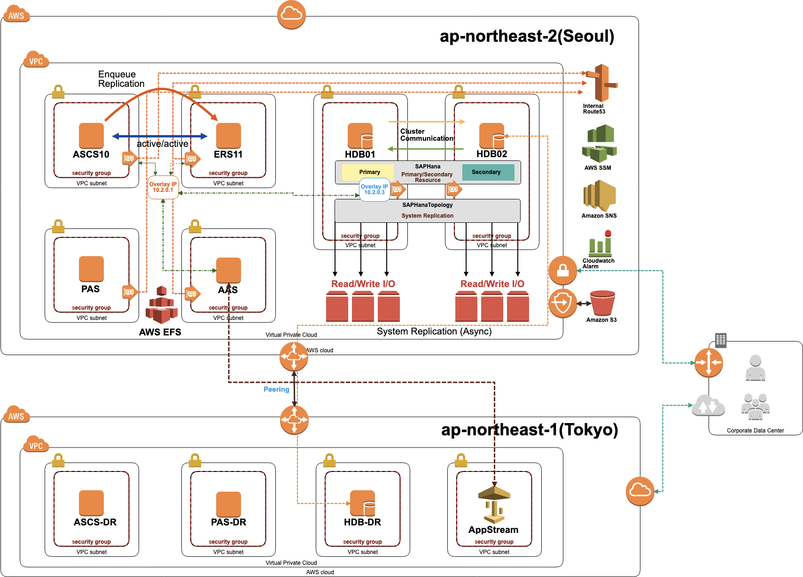

# SAP on AWS

## SAP on AWS Architecture

* OS : Suse Linux Enterprise Server for SAP Application 12 SP4
* SAP : SAP S/4HANA1709 FPS02
* DB : SAP HANA 2.0 SPS02 Rev20




위 구성은 AWS에서 권고하는 아키텍처를 기반으로 구성하였습니다.




ASCS \(ABAP SAP Central Service\) : Message Server를 가지고 LoadBalaning



ERS \(Enqueue Replication Server\) : 고가용성을 위해 Lock Table 복제 역할



PAS\(Primary Application Server\) : 첫 번째로 설치되는 Application Server



HANA\(High Performance analytic Appliance\) : SAP in-memory DB



HANA\(High Performance analytic Appliance\) : SAP in-memory DB



```
// Ain't no code for that yet, sorry
echo 'You got to trust me on this, I saved the world'
```


