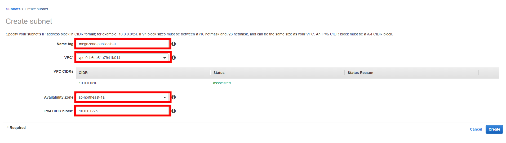
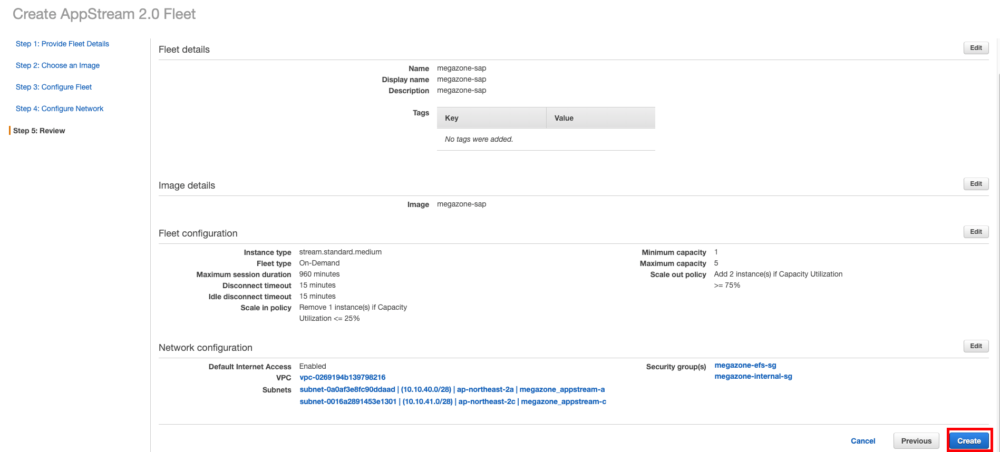
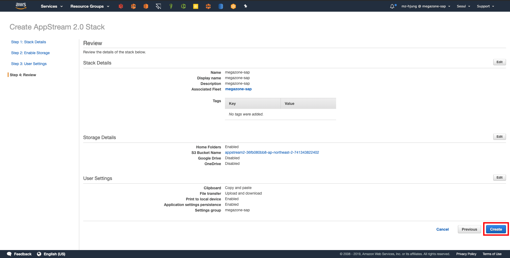

# AWS 환경 만들기

## 네트워크 환경 만들기


SAP구축전 고객과 협의하여 사용한 VPC CIDR대역과 이중화 여부를 확인하는 것이 추후에 혼선을 없앨수 있습니다.

아래 AWS 환경 부분은 고객사 환경마다 차이가 발생하므로 설명을 참고하시기 바랍니다.


### VPC 생성

VPC는 인프라가 올라게 될 기본적인 환경입니다. 추후 확장성 및 연동을 고려하여 CIDR 및 서브넷팅을 설계하시길 바랍니다.


Name Tag : VPC 이름, Tag 의 Name값이라고 생각하면 됨 \(추후에 변경 가능\)  
IPv4 CIDE block : VPC에서 사용 할 CIDR 대역 자세한 설명은 아래 링크 참조  
[https://docs.aws.amazon.com/vpc/latest/userguide/what-is-amazon-vpc.html](https://docs.aws.amazon.com/vpc/latest/userguide/what-is-amazon-vpc.html)


### Subnet생성


VPC를 생성하면 생성된 VPC에 사용할 수 있는 서브넷이 없기 때문에 새로 생성해주어야 합니다.  
용도에 맞게 네이밍과 크기를 정하시는 것이 중요합니다.



Name Tag : Subnet 구분할 수 있는 Name Tab \(예: megazone-public-sb-a:고객명-용도-서브넷-AZ표\)  
VPC : 서브넷을 생성할 VPC  
Availability Zone : 서브넷이 사용 할 AZ 설정  
IPv4 CIDR block : 사용할 IP CIDR 설정 \(최소 28비트\) : 사용할 인스턴스들을 고려하여 넉넉하게 설정할 것을 권고 합니다. \(추후 변경 불가\)


### Routing Table 생성


Routing Table은 외부와의 통신을 어떤 게이트웨이를 통하게 할지에 대한 설정이며, 다음에 생성할 Internet Gateway\(이하 IGW\)와 NAT Gateway\(이하 NAT\)와 연관되어 있습니다.

기본적으로 라우팅 테이블을 나누는 기준은 통신할 인스턴스가 외부와의 직접적인 통신이 필요하느냐 마느냐에 따라 달라지며, SAP 환경에서는 크게 Public,Private로 나누어서 설정할 것을 권고 합니다.

* Public : 외부와의 직접적인 통신, 사용자가 Application으로의 접근을 직접적으로 할 경우 설정합니다. 외부 통신\(0.0.0.0/0\)은 IGW를 통하여 설정하는 것이 일반적
* Private : 내부 통신을 주로 사용하는 인스턴스에 설정하며 사용자들이 직접적으로 통신할 필요할 경우에 인스턴스들이 Private Routing테이블을 타도록 합니다. 하지만 외부 통신\(커널 업데이트, 소프트웨어 업데이트 등\)이 필요하기 때문에, NAT를 이용하여 아웃바운드 통신하도록 합니다.
* 라우팅 테이블 생성 시 기본적으로 VPC내부에 대한 라우팅은 Default하게 생성되어 있습니다. 



* Name Tag : 라우팅 테이블의 이름
* VPC : Routing Table을 위치할 VPC 지정


### Internet Gateway생성


Internet Gateway는 생성 후 생성한 VPC에 Attach 시켜줘야 사용할 수 있습니다.


### NAT Gateway 생성


NAT Gateway의 경우 IGW를 타는 라우팅 테이블\(외부통신이 가능한\)이 설정된 Subnet에 생성해야합니다.


### Routing Table 수정


IGW,NAT를 생성하고 나서는 각각 Routing Table에 매칭해줘야 사용할 수 있습니다.  
물론 Routing 테이블에 적용 후 각 Subnet들을 용도에 맞게 Association 해주시는 것도 좋습니다.


### Security Group 생성


Inbound/Outbound 정책은 아래 AWS 정식 가이드 참고 하시기 바랍니다. Source IP는 예시입니다.  
\#\#으로 표시된 부분은 Instance ID과 매칭하여 사용하시기 바랍니다.


The following are the configured inbound and outbound protocols and ports allowed for the various instances deployed as part of this solution:

| RDP Security Group |  |  |  |
| :--- | :--- | :--- | :--- |
| **Inbound:** |  |  |  |
| **Source** | **Protocol** | **Port Range \(Service\)** | **Comments** |
| Restricted to CIDR block specified during the deployment process | TCP | 3389 \(RDP\) | Allows inbound RDP access to Windows instances from your network \(over the internet gateway\). |
| **Outbound:** |  |  |  |
| **Destination** | **Protocol** | **Port Range** | **Comments** |
| 0.0.0.0/0 | TCP | 1-65535 | Allows outbound access from RDP server to anywhere. |

| Bastion Host Security Group |  |  |  |
| :--- | :--- | :--- | :--- |
| **Inbound:** |  |  |  |
| **Source** | **Protocol** | **Port Range \(Service\)** | **Comments** |
| Restricted to CIDR block specified during the deployment process | TCP | 22 \(SSH\) | Allows inbound SSH access to Linux instances from your network \(over the internet gateway\). |
| **Outbound:** |  |  |  |
| **Destination** | **Protocol** | **Port Range** | **Comments** |
| 10.0.1.0/24 | TCP | 22 \(SSH\) | Allows SSH access from the bastion host to the 10.0.1.0 subnet. |
| 0.0.0.0/0 | TCP | 80 \(HTTP\) | Allows outbound HTTP access from instances deployed in the VPC to anywhere. |
| 0.0.0.0/0 | TCP | 443 \(HTTPS\) | Allows outbound HTTPS access from instances deployed in the VPC to anywhere. |

| SAP HANA Master and Worker\*\* Security Groups |  |  |  |
| :--- | :--- | :--- | :--- |
| **Inbound** _\(\#\# corresponds to the SAP instance number\):_ |  |  |  |
| **Source** | **Protocol** | **Port Range \(Service\)** | **Comments** |
| 10.0.1.0/24 | TCP | 1-65535 | Communication between instances within the private subnet. |
| 10.0.1.0/24 | TCP/UDP | 111, 2049, 4000-4002 | Ports used for NFS communication. |
| 10.0.1.0/24 | TCP | 3\#\#00–3\#\#10 | Database internal communication and SAP support access. |
| \*\*10.0.1.0/24 | TCP | 22 \(SSH\) | Allows SSH access from other SAP HANA nodes. |
| 10.0.2.0/24 | TCP | 22 \(SSH\) | Allows SSH access from the bastion host placed in the public subnet. |
| 10.0.2.0/24 | TCP | 1128-1129 | Host agent access. |
| 10.0.2.0/24 | TCP | 43\#\# | Access to XSEngine \(HTTPS\) from the 10.0.2.0 subnet. |
| 10.0.2.0/24 | TCP | 80\#\# | Access to XSEngine \(HTTP\) from the 10.0.2.0 subnet. |
| 10.0.2.0/24 | TCP | 8080 \(HTTP\*\) | Software Update Manager \(SUM\) access \(HTTP\). |
| 10.0.2.0/24 | TCP | 8443 \(HTTPS\*\) | Software Update Manager \(SUM\) access \(HTTPS\). |
| 10.0.2.0/24 | TCP | 3\#\#13 | Database client access to system database. |
| 10.0.2.0/24 | TCP | 3\#\#15 | Database client access. |
| 10.0.2.0/24 | TCP | 3\#\#17 | Database client access. |
| 10.0.2.0/24 | TCP | 3\#\#41-3\#\#44 | Database client access to tenant database. |
| 10.0.2.0/24 | TCP | 5\#\#13–5\#\#14 | Allows access for HANA Studio from RDP instance. |
| **Outbound:** |  |  |  |
| **Destination** | **Protocol** | **Port Range** | **Comments** |
| 0.0.0.0/0 | TCP | 1-65535 | Allows outbound access from SAP HANA master to anywhere. |

## Application\(ASCS,ERS,AAS,PAS,HANA\) 설치를 위한 EC2 생성


SAP A1의 경우 대부분 SuSE 혹은 Redhat 환경으로 운영되고 있습니다.  
고객사 요구사항에 맞춰 구성을 진행하여도 무방합니다. 하지만 이중화 여부에 따라 AMI 선택을 다르게 진행하셔야 합니다.  


### Amazon Machine Image 선택 기준

| 운영체제 | Single AZ | Multi AZ | 비 |
| :--- | :--- | :--- | :--- |
| SLES 11 SP4 SLES 12 SLES 12 SP1 SLES 12 SP3 SLES 15 | Y | N |  |
| SAP용 SLES 12 SP1 _SAP용 SLES 12 SP2_ SAP용 SLES 12 SP3\*  | Y | Y | $2.638/hr |

> 위 내용은 한국 리전\(ap-northeast-2\)기준이며 몇몇 AMI의 경우 EOS이거나 예정입니다. 최근에는 SuSE Linux 15버전까지 추가되었으나 SAP에 공식적인 Competency를 취득한 상태는 아닙니다.

### SLES \(SuSE Linux Enterprise Linux\)

### SuSe for SAP


두 이미지의 차이는 For SAP의 경우 SAP 운영을 위한 환경 변수들\(sapconf,env\)이 기본적으로 설정되어 있고  어플리케이션 업데이트를 위한 Repository가 다르게 설정되어 있습니다.  
믈런 SLES환경에도 pacemaker\(이중화 소프트웨어\)를 RPM을 이용하여 다운로드 및 설치가 가능하지만, Hawk설치 시 ruby package에 대한 부분을 설정해야하고 sapconf도  수작업으로 설정해줘야 합니다.


### 인스턴스 설치

#### AMI 선


이미지에 따라 선택할 수 있는 인스턴스 타입이 조금 씩 달라지게 됩니다.

* SLES 12 SP4 for SAP =&gt; t2타입은 t2.large만 선택 가능
* SLES 15 for SAP         =&gt; t3타입의 t3.micro,t3small 만 선택가능


#### 인스턴스 타입 선


인스턴스 선택 시 ASCS,ERS의 경우 가벼운 시스템이기 때문에 t3,t2로 가도 무방합니다.  
하지만, AAS,PAS,HANA의 경우 메모리가 많이 필요하므로 r5,r4타입을 선택하는 것을 권고하고 있습니다.  
정말 시스템이 무겁거나 클경우 i타입을 선택하시길 바랍니다.


#### Configuration Instance Details


* Network : 인스턴스가 설치될 VPC선택
* Subnet : 인스턴스가 설치될 Subnet선택
* Public IP를 할당한 것인가? Subnet 설정마다 다르지만 Disable을 권고 합니다.
* Placement Group : 어플리케이션에 따라 VM인스턴스들의 위치를 지정하고 싶은 경우 Spread모드와 Cluster모드가 존재 -&gt; Application에 따라 설정하지만 SAP환경에서는 필요 없음
* IAM role : 해당 EC2 인스턴스가 AWS 계정의 리소스를 컨트롤 하고자 할 때 필요한 Role을 맵핑
* Enable termination protection : 사람이라면 실수 할 수 있기 때문에 설정합시다.


#### EBS\(Elastic Block Storage\) 추가

> SAP의 경우 여러개의 디스크를 할당하여 파티션하여 사

#### Add Tags

> Tag값을 이용하여 다양한 작업들을 할 수 있습니다. EBS 백업과 이중화 작업 시 Tag값을 설정하여야 하기 때문에 몹시 중요할 수 있는 단계입니다.

#### Configure Security Group


Security Group은 따로 생성되어 있는게 없다면 AMI에 설정되어 있는 Default Security Group으로 생성할 수 있습니다.


#### 키파일 생성 혹은 기존의 키파일 사용하여 인스턴스 설

> 키파일의 경우 고객의 요구에 따라 추가 생성하셔도 됩니다. 최근에는 AWS Session Manager를 이용하여 시스템 운영하는 고객사들이 많아지고 있으므로 고객의 요구에 맞춰 키파일 관리는 다르게 가져가시길 바랍니다.

#### EIP \(Elastic IP\) 맵핑 - optional

> EIP가 필요한 경우 다음과 같이 맵핑하여 사용하시면 됩니다.

## 시스템 관련 설정

### EFS 생성


EFS를 이용하여 SAP이 운영할 라이브러리 및 설정들을 공유하여 사용. SAP on AWS 권고


### Hostname 설정


SAP환경에서는 시스템의 호스트네임 기반으로 어플리케이션이 구현됩니다.  
기존 On-Premise 환경에서는 /etc/hosts파일에 각각의 IP파일들을 맵핑하여 사용하지만 AWS 환경에서는   Route 53 \(internal\) 사용하는 것을 권고합니다.


### Timezone 설정


Application 설치 시 시스템 Timezone이 동일해야하기 때문에 설정할 필요가 있습니다.


### fdisk 및 파티셔닝, 마운트

#### fdisk

#### 마운트

