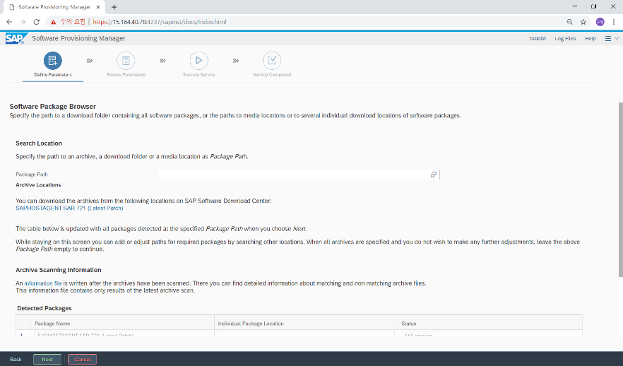
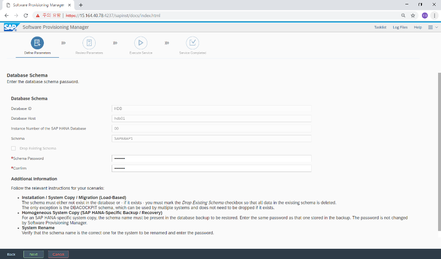
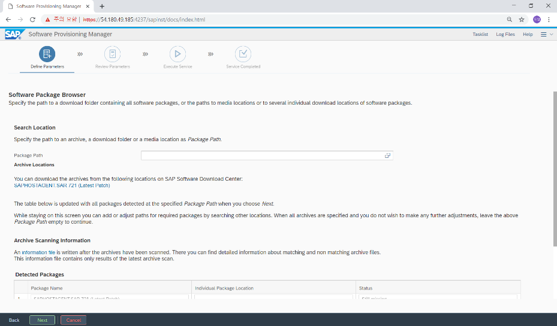

# Installation Steps for SAP S/4HANA 1709\(DEMO\)

## Goal of the Demo:

* SAP on AWS implementation

## Demo Environment:

* AWS, SUSE Linux, S/4HANA 1709

## Requirements for the Demo:

* Prerequisites:
  * Basic understanding of AWS and terms - EC2 \(and related\), VPC, NACL, Security Group, Region, Available Zone, Keypair, and others
* AWS account
  * 12 digits AWS account ID: _**YOUR\_AWS\_ACCOUNT\_ID**_

##  Architecture

* * OS : Suse Linux Enterprise Server for SAP Application 12 SP4
  * SAP : SAP S/4HANA1709 FPS02
  * DB : SAP HANA 2.0 SPS02 Rev20

## Prerequisties

* * Installation Media list

* * SWAP size 설정
* SAP Application Server for Linux \(SAP Notes. 1597355 참조\)

* SAP HANA DB : 2GB \(1999997 참조\)

## Installation Steps

* * Installation Steps for SAP HANA \(DB\)

*  HANA Media 경로에서 ./hdblcm 실행

* Choose an action : 1. Install
* Select additional components for installation : 2.3 server client

* Select system usage : 2 test \(운영의 경우 1, 개발의 경우 3 선택\)
* OS Password는 sapadm : qweR123$, &lt;sid&gt;adm : qweR123$
* DB Password 는 SYSTEM : qweR123$

 -

- SAP HANA Database System installed로 설치 완료 확인.

* * Installation Steps for S/4 HANA \(ASCS\)

* SWPM 경로에서 SAP AP \(ASCS\)설치 수행 ./sapinst SAPINST\_USE\_HOSTNAME=sapapp IS\_HOST\_LOCAL\_USING\_STRING\_COMPARE=true

* Ur로\(4237 포트\) 접속하여 SWPM 접속
* SAP S/4HANA Server 1709 &gt; SAP HANA Server &gt;

SAP HANA Database &gt; Installation &gt; High-Availability System &gt;

**ASCS Instance**

* SAP System ID \(SAPID\) : S4H \(3글자 지정\)
* SAP Mount : /sapmnt

* DNS Domain : megazone.com

* Password for All Users \(Master Password\) : QweR123$

* Password of SAP System Administrator : qweR123$
* UID와 GID는 개발, 품질, 운영서버 모두 동일하게 설정

* Kernel 파일 import

* Saphostagent 파일 import

* sapadm password 입력 : qweR123$

* ASCS instance number와 Hostname 입력

* Message Server 포트입력 : 3610

* next

* next

* review 정보를 최종 확인 후 수정 필요시 체크하고 수정

* review 정보를 최종 확인 후 수정 필요시 체크하고 수정

* review 정보를 최종 확인 후 수정 필요시 체크하고 수정

* review 정보를 최종 확인 후 수정 필요시 체크하고 수정

* 설치진행

* ASCS 설치완료
  * Installation Steps for S/4 HANA \(Database instance\)

* SWPM 경로에서 ./sapinst 실행

* SAP S/4HANA Server 1709 &gt; SAP HANA Server &gt; SAP HANA Database &gt; System Copy &gt; Target System &gt; High-Availability System &gt; Based on AS ABAP &gt; **Database Instance**

* /sapmnt/S4H/profile 경로 입력

* Message Server Port 3610

* Master Password : qweR123$

* SAP user password : qweR123$

* DB 백업본으로 설치를 위한 homogeneous system copy

* DB host, Instance Number, SID, SYSTEM password 입력

* Multi-tenent DB 정보 확인 및 password 입력

* DB백업을 위한 SYSTEM user password 입력

* Kernel 파일 import

* Dependent와 independent Kernel 2개를 import

* Saphostagent 파일 import

* Saphostagent 파일 import detected 확인

* Sapadm 계정 password 입력 \(UID와GID는 다른 인스턴스와 동일\)

* DB schema 정보 입력

* Sapcontrol connect data의 정보 입력

* 설치할 DB백업파일 경로 및 파일 지정

* HDB Client 설치파일 path 선택 \(Local\)

* HDB client 설치 미디어 path 지정

* next

* parameter Summary 내용 확인 후 변경사항 필요시

해당부분 선택 후 변경

* Database instance\(DI\) 설치 진행

* DI설치 완료
  * Installation Steps for S/4 HANA \(Primary Application Server Instance\)

* ./sapinst

* SAP S/4HANA Server 1709 &gt; SAP HANA Server

&gt; SAP HANA Database &gt; System Copy &gt; Target System

&gt; High-Availability System &gt; Based on AS ABAP

&gt; **PAS Instance**

* SAP system profile path 지정

* Message server 3610 port

* Master Password : qweR123$입력

* Sap kernel 및 igs 파일 import

* 설치 파일 지정 후 detected check

* Saphostagent 탐지 후 upgrade 선택

* 업그레이드 설치할 saphostagent 지정

* Detected된 saphostagent 파일 확인

* DB host, SID, instance number, password 정보 입력

* SAP kernel 파일 지정 선택

* Detected 된 kernel 파일 지정 및 import

* Saphostagent upgrade 선택

* saphostagent파일 지정

* detected package 확인

* DB SID, host 확인 및 DB instance number, password 입력

* Multitenant DB 정보 입력

* Use SAP liveCache integrated in SAP HANA 선택

* DBACOCKPIT password 입력

* SAPABAP1 schema password 입력

* PAS instance number 및 host name 입력

* Message server 3610 port 입력

* Do not create message server access control list 선택

* next

* ddic password 입력

* Default Key

* next

* summary 내용 확인후 변경사항 필요시 체크박스 선택 수정

* 설치진행

* 설치완료
  * Installation Steps for S/4 HANA \(Enqueue Replication Server Instance\)

* ./sapinst

SAP S/4HANA Server 1709 &gt; SAP HANA Server &gt; SAP HANA Database

&gt; Installation &gt; High-Availability System &gt; **ERS Instance**

* Sap system profile path입력

* ASCS Host 정보 입력 \(SID, Instance number, hostname\)

* SAP hostagent detected시 upgrade 체크

* Saphostagent 설치 미디어 path 입력

* Detected 된 saphostagent 미디어 체크

* ERS instance number 및 host 정보 입력

* next

* summary 내용 확인 후 수정 필요시 해당 내역 체크 후 수정

* 설치진행

* 설치완료

