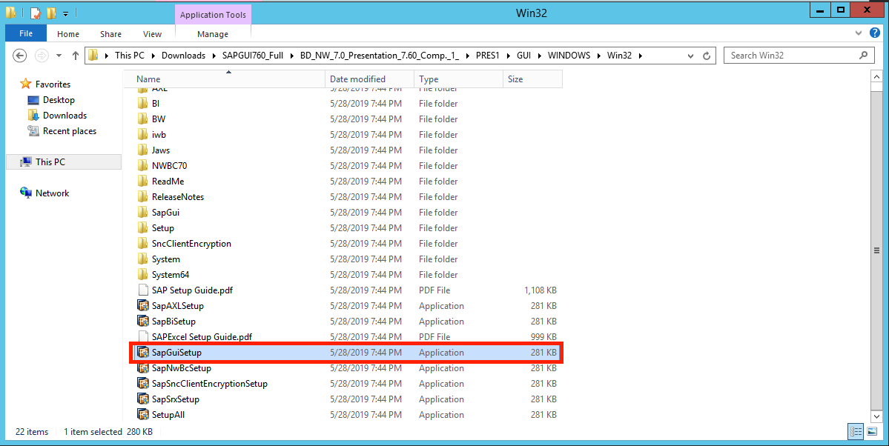
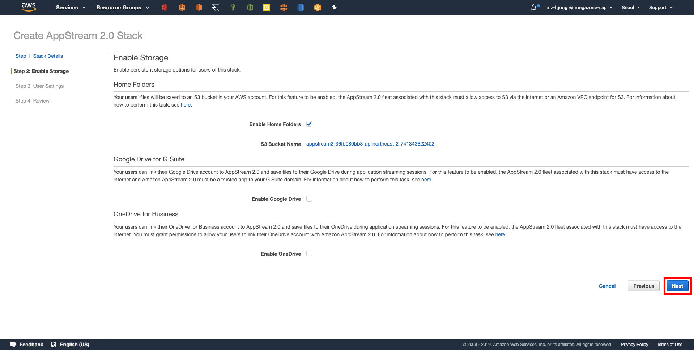
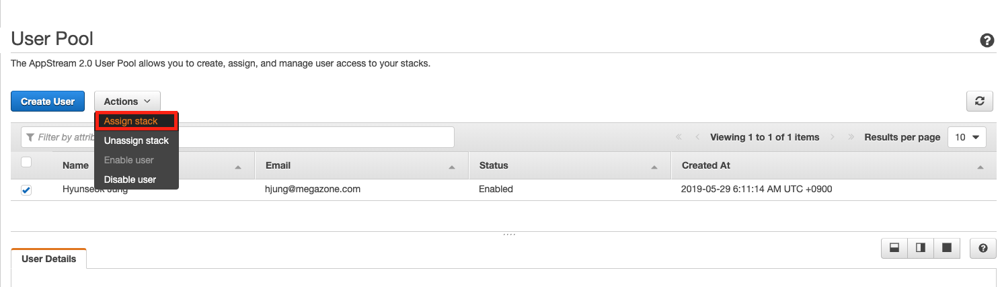

# SAPGUI on AppStream 2.0

## Network resources들을 설정하기

> AppStream 설치를 위하여 별도의 서브넷을 미리 할당 해놓는 것을 권장합니다. 총 User 사용 수량을 확인하여, Auto Scaling 최대치에 도달하여도 문제가 발생하지 않도록 설계하는 것을 권장합니다.
>
> Security Group은 App stream에 할당하여  SAP Application의 Security 그룹의 Source에 할당하는 것이 운영에 용이합니다.

## Create AppStream 2.0 image builder

> AppStream 2.0 은 EC2인스턴스를 사용하여 응용 프로그램을 스트리밍합니다. AppStream 2.0이 제공하는 Image Builder라고 하는 기본 이미지에서 인스턴스를 실행합니다. 사용자 지정 이미지를 만들려면 Image Builder인스턴스를 연결하고 어플리케이션 설치 및 구성을 진행 다음 Image Assistant를 이용하여 Snapshot을 만들어 이미지를 만듭니다.

### Image Builder 선택

| Option | Value |
| :--- | :--- |
| Name | 사용할 Image Builder의 이름 |
| Display Name | Image Builder에서 보여질 이 |
| Instance Type | 인스턴스 타입을 설정할 수 있습니다. \(Default : General Purpose\) |
| Instance Family | 인스턴스 세대군\( stream.standard.medium 추천\) |

### Image Builder 환경 구성

| Option | Value |
| :--- | :--- |
| Default Internet Access | SAPGUI 설치파일을 원할하게 다운 받기위하여 Enable |
| VPC | SAP Application이 설치되어 있는 VPC 선택\(당연?\) |
| Subnet  | 인터넷 연결을 위한 Subnet 할당 |
| Security Group | 아무거나 선택하여도 무방 \(default\) |
| Active Directory Domain | 이 설정은 필요 없습니다. |

## Connect to the image builder and install application

### Image Builder 연결

### Administrator로 접속

## Configure application

> SAPGUI를 다운로드합니다.
>
> * SAP GUI software -[http://support.sap.com/swdc](http://support.sap.com/swdc)

#### SAP GUI 인스톨러 설치

## Use image assistant to  create AppStream 2.0 image

### SAP GUI 실행 파라미터 설정

#### Launch Path : SAPGUI 실행 파일을 지

#### Launch Parameters : App인스턴스 사설 IP정보 입력, SID

#### Switch User를 이용하여 App이 다양한 계정 환경에서 운영이 가능합니다.

#### 실제 App 실행

#### 다음과 같이 정상적으로 실행되는 것을 확인하였습니다.


* Name : 생성된 이미지를 구분하게 할 수 있는 이름
* Display Name : App 실행 시에 보여지는 이


#### 설정 확인 후 이미지 생

#### 다음과 같이 이미지가 생성되는 것을 확인하였습니다.

## Provision a fleet

| Option | Value |
| :--- | :--- |
| Name | Fleet이름 |
| Display Name | AWS Console상에서 보여지는 이름 |
| Description | 설 |

#### 생성된 이미지 확인


Fleet Type은 두가지 값을 설정 할 수 있습니다. User들의 사용량을 확인하여 설정하는 것을 추천합니다.

* Always-On : Fleet을 항상 작동 시킴
* On-Demand : 사용한 만큼만 비용 부



Network 환경 구성 시에는,  SAP Application과 통신 할 수 있도록 구성하여야 합니다.

SAP GUI에서 인터넷 접근이 필요할 수 있기 때문에 인터넷 연결을 할 수 있도록 서브넷을 할당하세요


## Create an AppStream 2.0 stack and a streaming URL


Fleet은 사용자가 사용할 App 인스턴스라고 생각하시면 되고, Stack은 각 사용자들에 맞는 어플리케이션 구동 환경을 설정하는 부분이라고 생각하시면 됩니다.


### Stack Details

| Name | Value |
| :--- | :--- |
| Name | Stack을 구분하기 위한 이름 |
| Display Name | Console 사용에서 보여지는 이름 |
| Description | 해당 Stack에 대한 설명 |
| Redirect URL | 세션 종료 후 리다이렉션 하고 싶은 페이지가 있다면 설정 |
| Fleet | 연결하고 싶은 Fleet을 지 |

> AppStream 2.0경우 Application을 스트리밍으로 운영하기 때문에 저장소가 따로 필요한 경우 AWS S3에 저장하거나 다른 클라우드 스토리지\(Google Drive, OneDrive\)등을 사용할 수 있습니다.

## Manage user access with an AppStream 2.0 user pool

### 사용자가 접근 할 수 있도록 User 생성

### User에 맞춰 Stack을 할당

### User 생성 후 다음과 같이 메일이 포워딩 됩니다. Login Page를 클릭하여 Application을 실행 시키면 됩니다.

## Appendix

### [Amazon AppStream 2.0 Pricing](https://aws.amazon.com/appstream2/pricing/)

### [SAML 2.0을 사용하여 AppStream 2.0에 대한 Single Sign-On 액세스](https://docs.aws.amazon.com/ko_kr/appstream2/latest/developerguide/external-identity-providers.html)

### [AppStream 2.0에서 Active Directory 사용](https://docs.aws.amazon.com/ko_kr/appstream2/latest/developerguide/active-directory.html)

### [Amazon AppStream 2.0에 대한 Fleet Auto Scaling](https://docs.aws.amazon.com/ko_kr/appstream2/latest/developerguide/autoscaling.html)

